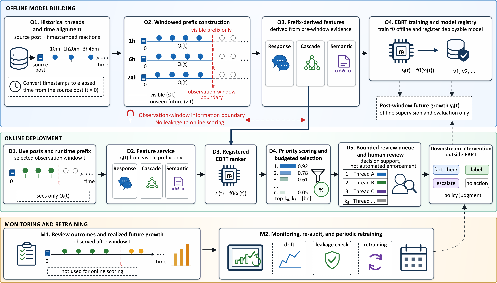

# Early Budgeted Rumor Triage

This repository contains the code release for Early Budgeted Rumor Triage (EBRT), a pipeline for ranking rumor threads under limited review budgets using early response, cascade, and semantic evidence.

## Repository layout

```text
.
├── data/                  # Dataset source and placement instructions only
├── figures/               # Public PNG example figure
├── requirements.txt       # Python dependencies
├── scripts/               # Entry-point scripts
└── src/research/          # Dataset parsing, features, triage, and reporting code
```

## Example Output

The repository includes one representative generated figure to illustrate the type of analysis produced by the pipeline. The figure summarizes how the strongest deployable signal family changes across datasets, observation windows, and sparse-response settings. This is useful for checking that a run produced the expected regime-level comparison outputs, rather than treating one model family as uniformly best in every setting.



`Fig1.png` is an example reporting artifact. It is not required as an input to the pipeline.

## Data

Raw datasets are not redistributed here. Download the original datasets from their providers and place them under one dataset root with these directory names:

```text
<dataset-root>/
├── CHECKED/
├── CSDC-Rumor/
└── PHEME/
```

The dataset sources and expected local file structures are documented in [data/README.md](data/README.md).

## Setup

```bash
python -m venv .venv
source .venv/bin/activate
pip install -r requirements.txt
```

Set dataset and output locations:

```bash
export RUMOR_SIM_DATASET_ROOT=/path/to/datasets
export RUMOR_SIM_OUTPUT_ROOT=/path/to/outputs
```

The output root should be outside the raw dataset directory. The code writes normalized checkpoints, features, text-model caches, triage metrics, tables, and generated figures under the output root.

## Check data placement

```bash
python scripts/check_target_datasets.py
```

## Run the pipeline

Lightweight text features:

```bash
python scripts/run_pipeline.py \
  --dataset-root "$RUMOR_SIM_DATASET_ROOT" \
  --output-root "$RUMOR_SIM_OUTPUT_ROOT" \
  --text-model-level light
```

Reuse cached text features in later runs:

```bash
python scripts/run_pipeline.py \
  --dataset-root "$RUMOR_SIM_DATASET_ROOT" \
  --output-root "$RUMOR_SIM_OUTPUT_ROOT" \
  --reuse-text-features \
  --text-model-level light
```

Optional heavy text-model features add multilingual zero-shot scores and require substantially more GPU time:

```bash
python scripts/run_pipeline.py \
  --dataset-root "$RUMOR_SIM_DATASET_ROOT" \
  --output-root "$RUMOR_SIM_OUTPUT_ROOT" \
  --text-model-level heavy
```

## Build summary tables

```bash
python scripts/build_summary_tables.py \
  --result-root "$RUMOR_SIM_OUTPUT_ROOT/results"
```

## Main scripts

- `scripts/check_target_datasets.py`: prints configured dataset paths and whether each dataset is present.
- `scripts/precompute_text_features.py`: parses datasets if needed and precomputes text features.
- `scripts/run_pipeline.py`: runs normalization, audits, graph summaries, features, text models, triage, and reporting.
- `scripts/build_summary_tables.py`: builds table-ready summaries from completed result files.

## License

This code release is distributed under the MIT License. See [LICENSE](LICENSE) for the full license text.

## Notes

- Raw datasets, generated results, model caches, checkpoints, and manuscript files are excluded from the repository.
- Dataset licenses and platform terms remain controlled by the original dataset providers.
- The code assumes Python 3.10+ and was developed with the packages listed in `requirements.txt`.
